# Modern SIS Architecture Diagrams

This document collects the main architecture and workflow diagrams for the Modern SIS baseline. All diagrams use Mermaid syntax so they can be rendered directly by Markdown tooling that supports Mermaid.

These diagrams complement, but do not replace, the detailed requirements in [SRS_Modern_SIS.md](../project/SRS_Modern_SIS.md), the stack baseline in [ADR-001](ADR-001-technology-baseline.md), the stack rationale in [technology-stack.md](technology-stack.md), and the data model in [modern-sis-erd.md](../diagrams/modern-sis-erd.md).

Rendered exports based on this source are organized under [../diagrams/rendered/](../diagrams/rendered/).

## Diagram Index

1. Use Case Overview
2. System Context
3. Integration Lanes Overview
4. Container Architecture
5. Backend Component Diagram
6. Data Sensitivity Boundaries
7. Sequence: Enrollment And Moodle Sync
8. Sequence: LTI Launch
9. Sequence: Nightly ETL And At-Risk Processing
10. Sequence: Wellbeing Check-In
11. Activity: Student Enrollment
12. Activity: Wellbeing Triage
13. State: Grade Record Lifecycle
14. State: Enrollment Lifecycle
15. Deployment Diagram

## 1. Use Case Overview

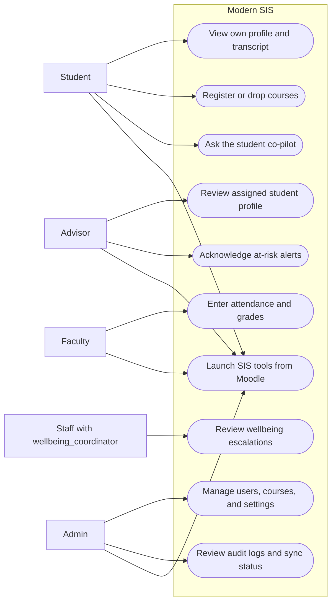

## 2. System Context

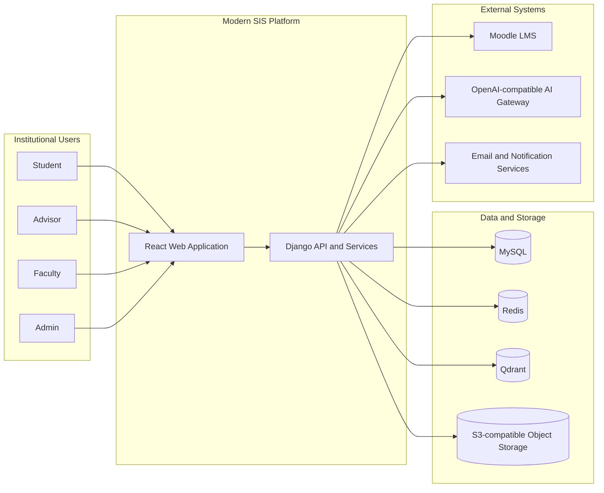

## 3. Integration Lanes Overview

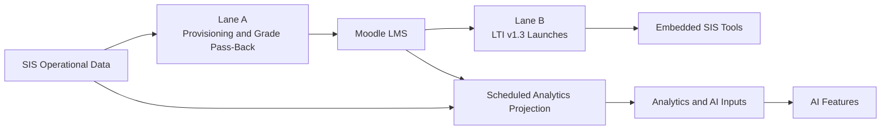

## 4. Container Architecture

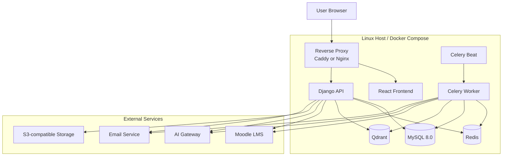

## 5. Backend Component Diagram

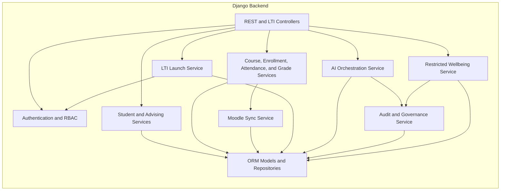

## 6. Data Sensitivity Boundaries

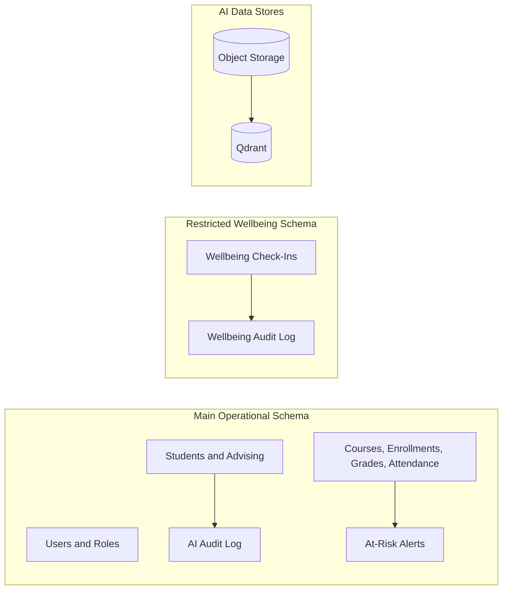

## 7. Sequence: Enrollment And Moodle Sync

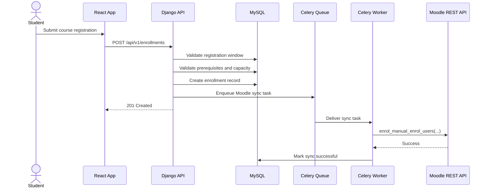

## 8. Sequence: LTI Launch

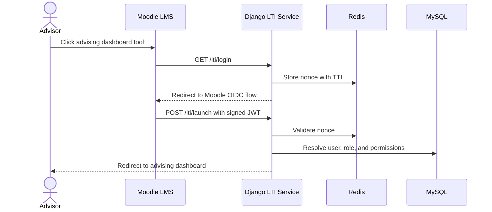

## 9. Sequence: Nightly ETL And At-Risk Processing

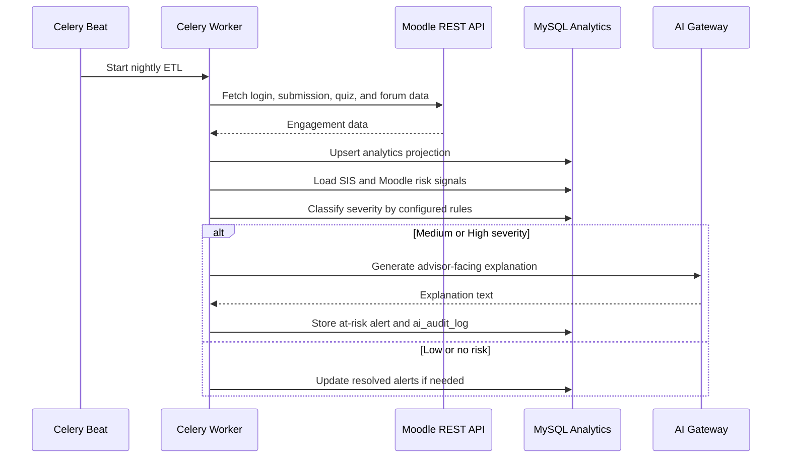

## 10. Sequence: Wellbeing Check-In

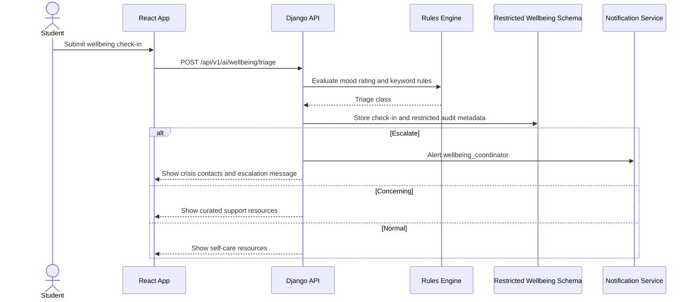

## 11. Activity: Student Enrollment

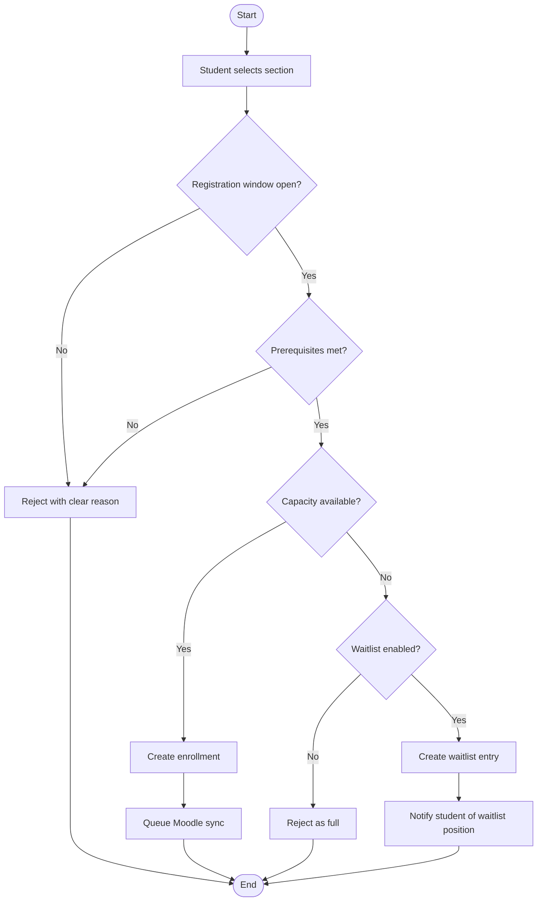

## 12. Activity: Wellbeing Triage

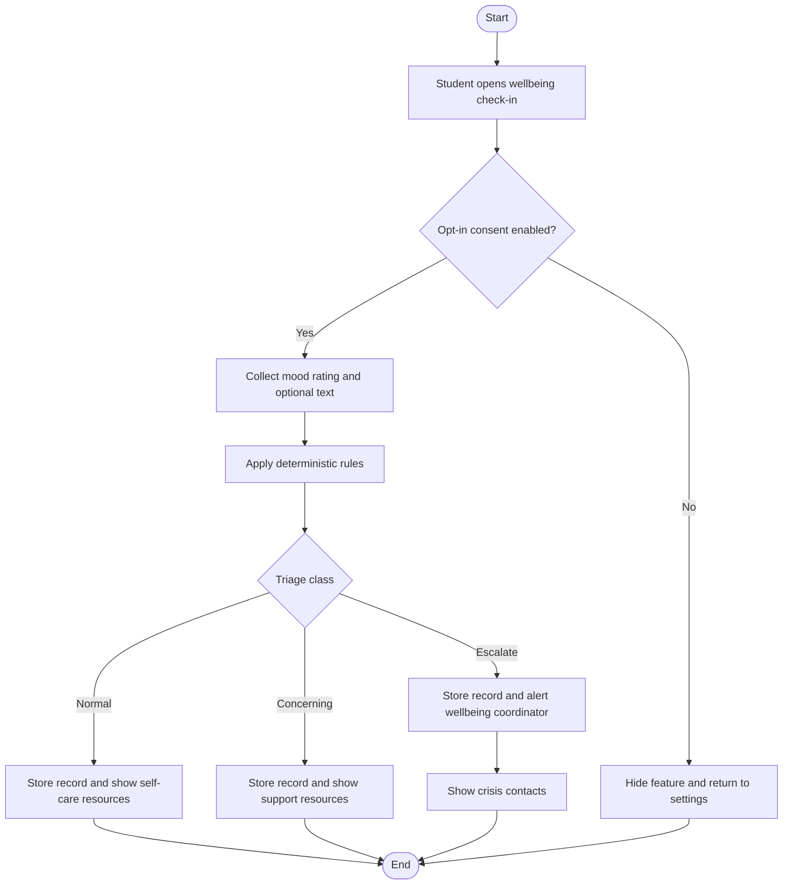

## 13. State: Grade Record Lifecycle

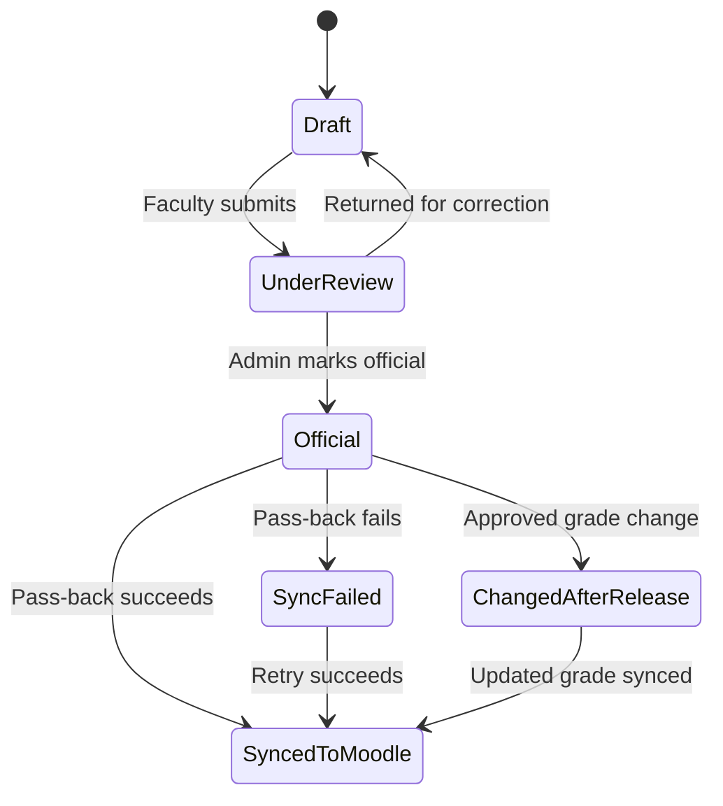

## 14. State: Enrollment Lifecycle

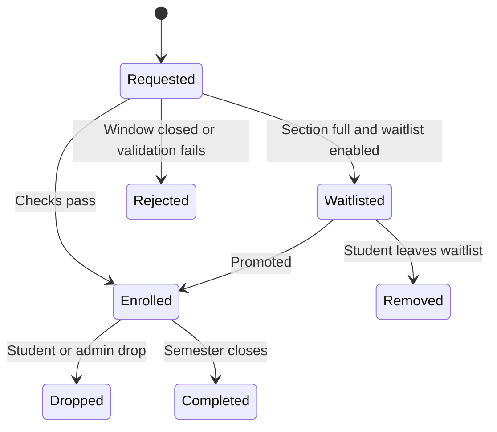

## 15. Deployment Diagram

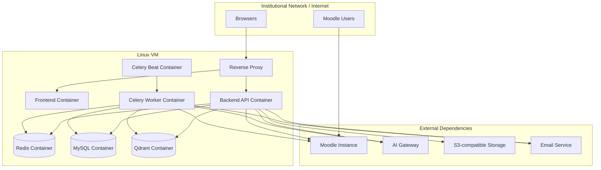

## Notes

- The `wellbeing_coordinator` is a capability overlay, not a fifth primary role.
- Lane A and Lane B intentionally describe different integration mechanisms and should not be collapsed into one generic sync narrative.
- The at-risk engine uses rules to determine severity and uses the LLM only for explanation text.
- Wellbeing workflows are approval-gated and use stricter storage and audit boundaries than the rest of the AI layer.
- The ERD remains the authoritative domain model reference for entity design.
