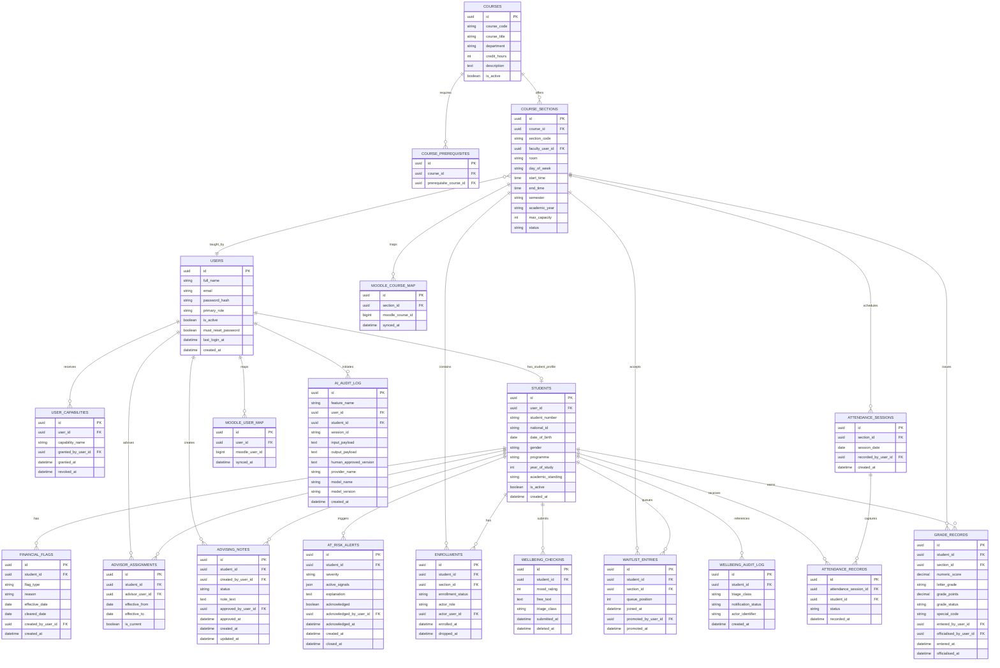

# Modern SIS ERD Draft

This ERD is a domain-model baseline for schema design. It is intentionally focused on the entities required by SRS v1.1 and the Phase 1 to Phase 3 delivery path.

## Notes

- `STUDENTS` is separated from `USERS` so institutional student attributes do not leak into non-student accounts.
- `ADVISOR_ASSIGNMENTS` is modeled historically, even though only one assignment is current at a time.
- `GRADE_RECORDS` keeps both numeric and derived grade state so transcript generation stays deterministic.
- `USER_CAPABILITIES` is how the `wellbeing_coordinator` access boundary is enforced without breaking the one-primary-role model.
- `WELLBEING_CHECKINS` and `WELLBEING_AUDIT_LOG` are intentionally separated from `AI_AUDIT_LOG`.
