# Modern SIS ERD

This ERD reflects the Step 2.3 Django schema currently implemented in the repository.

- `USERS.id` and related staff/user foreign keys are integer primary keys because the custom Django user model inherits Django's default auto-incrementing identifier.
- Student, course, section, enrollment, grade, and integration domain records use UUID primary keys.
- `SECTION_TIMETABLES` is modeled as a separate table because the implementation normalizes recurring meeting times out of `COURSE_SECTIONS`.
- Planned Phase 3 and Phase 4 entities such as Moodle mapping tables, AI audit logs, at-risk alerts, and wellbeing records remain governed by the SRS and architecture docs but are intentionally omitted here until their schema exists in code.

```mermaid
erDiagram
    USERS {
        int id PK
        string username
        string full_name
        string email
        string password_hash
        string primary_role
        boolean is_active
        boolean must_reset_password
        datetime last_login
        datetime date_joined
    }

    USER_CAPABILITIES {
        int id PK
        int user_id FK
        string capability_name
        datetime granted_at
    }

    ACCESS_LOGS {
        int id PK
        int actor_user_id FK
        int subject_user_id FK
        string event_type
        string view_name
        string request_path
        string request_method
        int response_status
        string ip_address
        json metadata
        datetime created_at
    }

    STUDENTS {
        uuid id PK
        int user_id FK
        string student_number
        string national_id
        date date_of_birth
        string gender
        string programme
        int year_of_study
        string academic_standing
        decimal cumulative_gpa
        string standing_override_reason
        boolean is_active
        datetime created_at
        datetime updated_at
    }

    ADVISOR_ASSIGNMENTS {
        uuid id PK
        uuid student_id FK
        int advisor_user_id FK
        date effective_from
        date effective_to
        boolean is_current
        datetime created_at
    }

    FINANCIAL_FLAGS {
        uuid id PK
        uuid student_id FK
        string flag_type
        string reason
        date effective_date
        date cleared_date
        int created_by_user_id FK
        datetime created_at
    }

    ADVISING_NOTES {
        uuid id PK
        uuid student_id FK
        int created_by_user_id FK
        text note_text
        string status
        int approved_by_user_id FK
        datetime approved_at
        datetime created_at
        datetime updated_at
    }

    COURSES {
        uuid id PK
        string course_code
        string course_title
        string department
        int credit_hours
        text description
        string programme_code
        int max_capacity
        boolean is_active
        datetime created_at
        datetime updated_at
    }

    COURSE_PREREQUISITES {
        uuid id PK
        uuid course_id FK
        uuid prerequisite_course_id FK
    }

    COURSE_SECTIONS {
        uuid id PK
        uuid course_id FK
        int faculty_user_id FK
        string section_code
        string room
        string semester
        string academic_year
        int max_capacity
        datetime registration_opens_at
        datetime registration_closes_at
        datetime drop_deadline
        decimal attendance_threshold
        string status
        datetime created_at
        datetime updated_at
    }

    SECTION_TIMETABLES {
        uuid id PK
        uuid section_id FK
        string day_of_week
        time start_time
        time end_time
    }

    ENROLLMENTS {
        uuid id PK
        uuid student_id FK
        uuid section_id FK
        string enrollment_status
        string actor_role
        int actor_user_id FK
        boolean is_active
        text reason
        datetime enrolled_at
        datetime dropped_at
        datetime updated_at
    }

    ENROLLMENT_EVENTS {
        uuid id PK
        uuid enrollment_id FK
        string event_type
        string actor_role
        int actor_user_id FK
        json details
        datetime created_at
    }

    WAITLIST_ENTRIES {
        uuid id PK
        uuid student_id FK
        uuid section_id FK
        string status
        int promoted_by_user_id FK
        datetime joined_at
        datetime promoted_at
    }

    ATTENDANCE_SESSIONS {
        uuid id PK
        uuid section_id FK
        date session_date
        int recorded_by_user_id FK
        datetime created_at
    }

    ATTENDANCE_RECORDS {
        uuid id PK
        uuid attendance_session_id FK
        uuid student_id FK
        string status
        datetime recorded_at
    }

    GRADING_SCALE_BANDS {
        uuid id PK
        string letter_grade
        decimal minimum_score
        decimal maximum_score
        decimal grade_points
        boolean is_passing
        int display_order
    }

    ACADEMIC_STANDING_RULES {
        uuid id PK
        string standing
        decimal minimum_gpa
        decimal maximum_gpa
        int display_order
    }

    GRADE_RECORDS {
        uuid id PK
        uuid student_id FK
        uuid section_id FK
        decimal numeric_score
        string letter_grade
        decimal grade_points
        string grade_status
        string special_code
        int entered_by_user_id FK
        int officialised_by_user_id FK
        datetime entered_at
        datetime officialised_at
        datetime updated_at
    }

    GRADE_CHANGE_LOGS {
        uuid id PK
        uuid grade_record_id FK
        decimal previous_numeric_score
        decimal new_numeric_score
        string previous_letter_grade
        string new_letter_grade
        string previous_grade_status
        string new_grade_status
        text reason
        int actor_user_id FK
        datetime created_at
    }

    INTEGRATION_OUTBOX_EVENTS {
        uuid id PK
        string event_type
        json payload
        string status
        datetime created_at
    }

    USERS ||--o| STUDENTS : has_student_profile
    USERS ||--o{ USER_CAPABILITIES : receives
    USERS ||--o{ ACCESS_LOGS : acts_in
    USERS ||--o{ ACCESS_LOGS : appears_as_subject

    STUDENTS ||--o{ ADVISOR_ASSIGNMENTS : assigned
    USERS ||--o{ ADVISOR_ASSIGNMENTS : advises
    STUDENTS ||--o{ FINANCIAL_FLAGS : carries
    USERS ||--o{ FINANCIAL_FLAGS : creates
    STUDENTS ||--o{ ADVISING_NOTES : has
    USERS ||--o{ ADVISING_NOTES : writes
    USERS ||--o{ ADVISING_NOTES : approves

    COURSES ||--o{ COURSE_PREREQUISITES : requires
    COURSES ||--o{ COURSE_PREREQUISITES : satisfies
    COURSES ||--o{ COURSE_SECTIONS : offers
    USERS ||--o{ COURSE_SECTIONS : teaches
    COURSE_SECTIONS ||--o{ SECTION_TIMETABLES : schedules

    STUDENTS ||--o{ ENROLLMENTS : holds
    COURSE_SECTIONS ||--o{ ENROLLMENTS : contains
    USERS ||--o{ ENROLLMENTS : acts_on
    ENROLLMENTS ||--o{ ENROLLMENT_EVENTS : records
    USERS ||--o{ ENROLLMENT_EVENTS : records

    STUDENTS ||--o{ WAITLIST_ENTRIES : joins
    COURSE_SECTIONS ||--o{ WAITLIST_ENTRIES : queues
    USERS ||--o{ WAITLIST_ENTRIES : promotes

    COURSE_SECTIONS ||--o{ ATTENDANCE_SESSIONS : hosts
    USERS ||--o{ ATTENDANCE_SESSIONS : records
    ATTENDANCE_SESSIONS ||--o{ ATTENDANCE_RECORDS : contains
    STUDENTS ||--o{ ATTENDANCE_RECORDS : accrues

    STUDENTS ||--o{ GRADE_RECORDS : earns
    COURSE_SECTIONS ||--o{ GRADE_RECORDS : issues
    USERS ||--o{ GRADE_RECORDS : enters
    USERS ||--o{ GRADE_RECORDS : officialises
    GRADE_RECORDS ||--o{ GRADE_CHANGE_LOGS : tracks
    USERS ||--o{ GRADE_CHANGE_LOGS : changes
```

